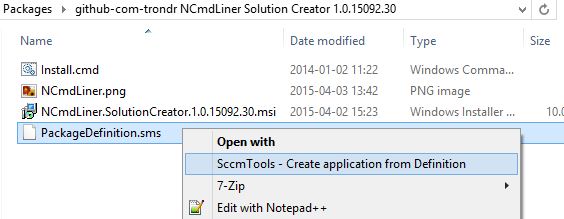
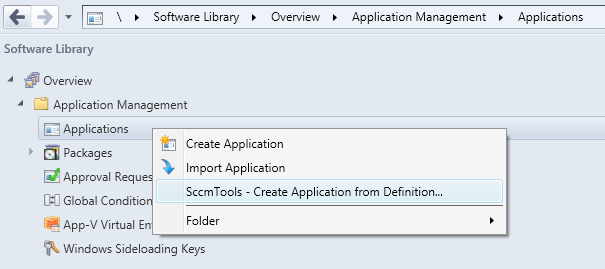

# SccmTools

SccmTools provides various commands for SCCM 2012 interaction

## Minimum Build Requirements

* MSBuild (http://www.microsoft.com/en-us/download/details.aspx?id=40760)
* Windows SDK (http://msdn.microsoft.com/en-us/windows/desktop/bg162891.aspx)
* .NET Framework 4.5.2 Runtime (http://go.microsoft.com/fwlink/?LinkId=397674)
* .NET Framework 4.5.2 Developer Pack (http://go.microsoft.com/fwlink/?LinkId=328857)
* .NET Framework 2.0/3.5 (Install from Windows Features on Windows 8.1/Windows Server 2012 R2)
* Wix Toolset 3.8 (http://wix.codeplex.com/downloads/get/762937)
* System Center 2012 R2 Configuration Manager Console
* The directory '.\bin\Libs' must contain:
	* **AdminUI.WqlQueryEngine.dll** (from the Configuration Manager Console)
	* **DcmObjectModel.dll** (from the Configuration Manager Console)
	* **Microsoft.ConfigurationManagement.ApplicationManagement.dll** (from the Configuration Manager Console)
	* **Microsoft.ConfigurationManagement.ApplicationManagement.MsiInstaller.dll** (from the Configuration Manager Console)
	* **Microsoft.ConfigurationManagement.ManagementProvider.dll** (from the Configuration Manager Console)
	* **Microsoft.Deployment.WindowsInstaller.dll** (from the Windows Installer XML Toolset)
	
## Commands

### CreateApplicationFromDefinition

Create a SCCM 2012 application from a package definition file. The PackageDefinition.sms format is documented here: https://technet.microsoft.com/en-ca/library/bb632631.aspx. This is useful in simpler script install scenarios where only install and uninstall command line is necessary and the application is installed by a msi file. Application detection method will be based on the msi product code. The msi product  code on the format '{...guid...}', can be stored in the custom section key [DetectionMethod]MsiProductCode or can be  manually defined anywhere in the [Package Definition]Comment value. If the product  code is not manually defined, the msi product code will be attempted automatically retrieved from the msi file found by directory search of the content folder, the folder where the package definition file is located. If more than one msi file is found, an exception is thrown asking for manual definition of  product code. The package definition file is required to have a [INSTALL] program and a [UNINSTALL] program. The following values are recognized and read from the package definition file: [Package Definition]Name, [Package Definition]Version, [Package Definition]Publisher, [Package Definition]Language, [Package Definition]Comment=<msi product code can be provided somewhere in this comment field>, [INSTALL]CommandLine, [INSTALL]Icon, [UNINSTALL]CommandLine.

The command can be run from:

* **Command line**
```
SccmTools.exe CreateApplicationFromDefinition /packageDefinitionFile="\\servername\appsource\Some Application 1.0\Pkg\PackageDefinition.sms" 
```
* **Windows Explorer context menu:** 



* **Configuration Manager Console context menu:**



#### Recognized package definition values:
	
* [Package Definition]Name
* [Package Definition]Version
* [Package Definition]Publisher
* [Package Definition]Language
* [INSTALL]CommandLine
* [INSTALL]Icon
* [UNINSTALL]CommandLine
* [DetectionMethod]MsiProductCode
		
All other values in package definition file are ignored.
	
#### Example package definition file

```dosini
[PDF]
Version=2.0

[Package Definition]
Name=My Product
Version=1.0.15318.1
Publisher=My Company AS
Language=EN
Comment=
Programs=INSTALL,UNINSTALL

[INSTALL]
Name=INSTALL
CommandLine=Install.cmd Install > "%Public%\Logs\MyCompany_My_Product1_0_15318_1_Install.cmd.log"
CanRunWhen=AnyUserStatus
UserInputRequired=False
AdminRightsRequired=True
UseInstallAccount=True
Run=Minimized
Icon=App.ico
Comment=

[UNINSTALL]
Name=UNINSTALL
CommandLine=Install.cmd UnInstall > "%Public%\Logs\MyCompany_My_Product1_0_15318_1_UnInstall.cmd.log"
CanRunWhen=AnyUserStatus
UserInputRequired=False
AdminRightsRequired=True
UseInstallAccount=True
Run=Minimized
Comment=

[DetectionMethod]
MsiProductCode={E1C62E82-D565-4C5D-9665-2D9D27A95086}

```

## Command line help

```
SccmTools 1.0.15319.1.0108ea5 - SccmTools provides various commands for Sccm 2012 interaction
Copyright © github.com.trondr 2015
Author: github.com/trondr
Usage: SccmTools.exe <command> [parameters]

Commands:
---------
Help                              Display this help text
License                           Display license
Credits                           Display credits
CreateApplicationFromDefinition   Create a SCCM 2012 application from a
                                  package definition file. The
                                  PackageDefinition.sms format is documented
                                  here:
                                  https://technet.microsoft.com/en-ca/library/bb632631.aspx.
                                  This is useful in simpler script install
                                  scenarios where only install and uninstall
                                  command line is necessary and the
                                  application is installed by a msi file.
                                  Application detection method will be based
                                  on the msi product code. The msi product
                                  code on the format '{...guid...}', can be
                                  stored in the custom section key
                                  [DetectionMethod]MsiProductCode or can be
                                  manually defined anywhere in the [Package
                                  Definition]Comment value. If the product
                                  code is not manually defined, the msi
                                  product code will be attempted
                                  automatically retrieved from the msi file
                                  found by directory search of the content
                                  folder, the folder where the package
                                  definition file is located. If more than
                                  one msi file is found, an exception is
                                  thrown asking for manual definition of
                                  product code. The package definition file
                                  is required to have a [INSTALL] program and
                                  a [UNINSTALL] program. The following values
                                  are recognized and read from the package
                                  definition file: [Package Definition]Name,
                                  [Package Definition]Version, [Package
                                  Definition]Publisher, [Package
                                  Definition]Language, [Package
                                  Definition]Comment=<msi product code can be
                                  provided somewhere in this comment field>,
                                  [INSTALL]CommandLine, [INSTALL]Icon,
                                  [UNINSTALL]CommandLine.

Commands and parameters:
------------------------
CreateApplicationFromDefinition   Create a SCCM 2012 application from a
                                  package definition file. The
                                  PackageDefinition.sms format is documented
                                  here:
                                  https://technet.microsoft.com/en-ca/library/bb632631.aspx.
                                  This is useful in simpler script install
                                  scenarios where only install and uninstall
                                  command line is necessary and the
                                  application is installed by a msi file.
                                  Application detection method will be based
                                  on the msi product code. The msi product
                                  code on the format '{...guid...}', can be
                                  stored in the custom section key
                                  [DetectionMethod]MsiProductCode or can be
                                  manually defined anywhere in the [Package
                                  Definition]Comment value. If the product
                                  code is not manually defined, the msi
                                  product code will be attempted
                                  automatically retrieved from the msi file
                                  found by directory search of the content
                                  folder, the folder where the package
                                  definition file is located. If more than
                                  one msi file is found, an exception is
                                  thrown asking for manual definition of
                                  product code. The package definition file
                                  is required to have a [INSTALL] program and
                                  a [UNINSTALL] program. The following values
                                  are recognized and read from the package
                                  definition file: [Package Definition]Name,
                                  [Package Definition]Version, [Package
                                  Definition]Publisher, [Package
                                  Definition]Language, [Package
                                  Definition]Comment=<msi product code can be
                                  provided somewhere in this comment field>,
                                  [INSTALL]CommandLine, [INSTALL]Icon,
                                  [UNINSTALL]CommandLine.
   /packageDefinitionFile         [Optional] Package definition file as
                                  specified by
                                  https://technet.microsoft.com/en-ca/library/bb632631.aspx.
                                  It is required that file path is a unc
                                  path. If this parameter is not specified a
                                  file dialog will be shown to the user.
                                  Alternative parameter name: /pf. Default
                                  value:

   Example: SccmTools.exe CreateApplicationFromDefinition /packageDefinitionFile="\\servername\appsource\Some Application 1.0\Pkg\PackageDefinition.sms" 
   Example (alternative): SccmTools.exe CreateApplicationFromDefinition /pf="\\servername\appsource\Some Application 1.0\Pkg\PackageDefinition.sms" 
```
