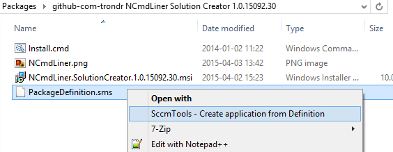
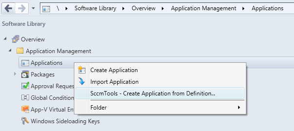

# SccmTools

SccmTools provides a command for creating an SCCM 2012 application from a package definition file.

## Commands

### CreateApplicationFromDefinition

Create SCCM 2012 application from a package definition file. The PackageDefinition.sms format is documented here: https://technet.microsoft.com/en-ca/library/bb632631.aspx. This command is useful in simpler script install scenarios where only an install and an uninstall command line is suffcient. Application detection method will be based on the msi product code of the installed msi or on a specified registry value. The msi product code on the format '{{...guid...}}', should be defined in the custom section key [DetectionMethod]MsiProductCode. If the product code is not manually defined, the msi product code will be attempted automatically retrieved from any msi file found by directory search of the content folder, the folder where the package definition file is located. If more than one msi file is found, an exception is thrown asking for manual definition of product code. If the content directory does not contain a msi file, a registry value can be defined as detection method by specifying the value [DetectionMethod]RegistryValue. The install script is in this case responsible for writing this registry value on install and removing the registry value on uninstall. The package definition file is required to have a [INSTALL] program and a [UNINSTALL] program. The following values are recognized and read from the package definition file: [Package Definition]Name, [Package Definition]Version, [Package Definition]Publisher, [Package Definition]Language, [Package Definition]Comment, [INSTALL]CommandLine, [INSTALL]Icon, [UNINSTALL]CommandLine, [DetectionMethod]MsiProductCode, [DetectionMethod]RegistryValue, [DetectionMethod]RegistryValueIs64Bit. The location of the package definition file must be on a network drive or an UNC path. The command will automatically derive the UNC path from a network drive.

The command can be run from:

* **Command line**
```
SccmTools.exe CreateApplicationFromDefinition /packageDefinitionFile="\\servername\appsource\Some Application 1.0\Pkg\PackageDefinition.sms" 
```
* **Windows Explorer context menu:** 



* **Configuration Manager Console context menu:**



#### Recognized package definition values:
	
* [Package Definition]Name
* [Package Definition]Version
* [Package Definition]Publisher
* [Package Definition]Language
* [Package Definition]Comment
* [INSTALL]CommandLine
* [INSTALL]Icon
* [UNINSTALL]CommandLine
* [DetectionMethod]MsiProductCode
* [DetectionMethod]RegistryValue
* [DetectionMethod]RegistryValueIs64Bit
* [Dependencies]Dependency01
* [Dependencies]Dependency02
* ...
* [Dependencies]DependencyXX
		
All other values in package definition file are ignored.
	
#### Example package definition file using MSI product code detection method

```dosini
[PDF]
Version=2.0

[Package Definition]
Name=My Product
Version=1.0.15318.1
Publisher=My Company AS
Language=EN
Comment=
Programs=INSTALL,UNINSTALL

[INSTALL]
Name=INSTALL
CommandLine=Install.cmd Install > "%Public%\Logs\MyCompany_My_Product1_0_15318_1_Install.cmd.log"
CanRunWhen=AnyUserStatus
UserInputRequired=False
AdminRightsRequired=True
UseInstallAccount=True
Run=Minimized
Icon=App.ico
Comment=

[UNINSTALL]
Name=UNINSTALL
CommandLine=Install.cmd UnInstall > "%Public%\Logs\MyCompany_My_Product1_0_15318_1_UnInstall.cmd.log"
CanRunWhen=AnyUserStatus
UserInputRequired=False
AdminRightsRequired=True
UseInstallAccount=True
Run=Minimized
Comment=

[DetectionMethod]
MsiProductCode={E1C62E82-D565-4C5D-9665-2D9D27A95086}

```

#### Example package definition file using registry value detection method.

```dosini
[PDF]
Version=2.0

[Package Definition]
Name=My Product
Version=1.0.15318.1
Publisher=My Company AS
Language=EN
Comment=
Programs=INSTALL,UNINSTALL

[INSTALL]
Name=INSTALL
CommandLine=Install.cmd Install > "%Public%\Logs\MyCompany_My_Product1_0_15318_1_Install.cmd.log"
CanRunWhen=AnyUserStatus
UserInputRequired=False
AdminRightsRequired=True
UseInstallAccount=True
Run=Minimized
Icon=App.ico
Comment=

[UNINSTALL]
Name=UNINSTALL
CommandLine=Install.cmd UnInstall > "%Public%\Logs\MyCompany_My_Product1_0_15318_1_UnInstall.cmd.log"
CanRunWhen=AnyUserStatus
UserInputRequired=False
AdminRightsRequired=True
UseInstallAccount=True
Run=Minimized
Comment=

[DetectionMethod]
RegistryValue = [HKLM\SOFTWARE\My Company\My Product\Setup]InstallRevision=Product_revision_1
RegistryValueIs64Bit = true

```

#### Example package definition file with dependencies

```dosini

[PDF]
Version = 2.0

[Package Definition]
Name = Test Application with dependency
Version = 1.0.16239.2
Publisher = MyCompany
Language = EN
Comment = Test Comment
Programs = INSTALL,UNINSTALL

[INSTALL]
Name = INSTALL
CommandLine = Install.cmd > "%Public%\Logs\Test_Application_with_dependency_1_0_16239_2_Install.cmd.log"
CanRunWhen = AnyUserStatus
UserInputRequired = False
AdminRightsRequired = True
UseInstallAccount = True
Run = Minimized
Icon = App.ico
Comment = 

[UNINSTALL]
Name = UNINSTALL
CommandLine = UnInstall.cmd > "%Public%\Logs\Test_Application_with_dependency_1_0_16239_2_UnInstall.cmd.log"
CanRunWhen = AnyUserStatus
UserInputRequired = False
AdminRightsRequired = True
UseInstallAccount = True
Run = Minimized
Comment = 

[DetectionMethod]
MsiProductCode = 
RegistryValue = [HKLM\Software\MyCompany\Test Application with dependency]InstalledStamp=tawd_1.0.16239.2
RegistryValueIs64Bit = true
 
[Dependencies]
Dependency1="Test Application Service 1";"1.0.16239.2"
Dependency2="Test Application Service 2";"1.0.16239.2"

```

## Command line help

```
SccmTools 1.0.17046.5.c47980e - SccmTools provides a command for creating an SCCM 2012 application from a package definition file.
Copyright © github.com.trondr 2017
Author: trondr@outlook.com
Usage: SccmTools.exe <command> [parameters]

Commands:
---------
Help                              Display this help text
License                           Display license
Credits                           Display credits
CreateApplicationFromDefinition   Create a SCCM 2012 application from a
                                  custom package definition file.

Commands and parameters:
------------------------
CreateApplicationFromDefinition   Create SCCM 2012 application from a package
                                  definition file. The PackageDefinition.sms
                                  format is documented here:
                                  https://technet.microsoft.com/en-ca/library/bb632631.aspx.
                                  This command is useful in simpler script
                                  install scenarios where only an install and
                                  an uninstall command line is suffcient.
                                  Application detection method will be based
                                  on the msi product code of the installed
                                  msi or on a specified registry value. The
                                  msi product code on the format
                                  '{...guid...}', should be defined in the
                                  custom section key
                                  [DetectionMethod]MsiProductCode. If the
                                  product code is not manually defined, the
                                  msi product code will be attempted
                                  automatically retrieved from any msi file
                                  found by directory search of the content
                                  folder, the folder where the package
                                  definition file is located. If more than
                                  one msi file is found, an exception is
                                  thrown asking for manual definition of
                                  product code. If the content directory does
                                  not contain a msi file, a registry value
                                  can be defined as detection method by
                                  specifying the value
                                  [DetectionMethod]RegistryValue. The install
                                  script is in this case responsible for
                                  writing this registry value on install and
                                  removing the registry value on uninstall.
                                  The package definition file is required to
                                  have a [INSTALL] program and a [UNINSTALL]
                                  program. The following values are
                                  recognized and read from the package
                                  definition file: [Package Definition]Name,
                                  [Package Definition]Version, [Package
                                  Definition]Publisher, [Package
                                  Definition]Language, [Package
                                  Definition]Comment, [INSTALL]CommandLine,
                                  [INSTALL]Icon, [UNINSTALL]CommandLine,
                                  [DetectionMethod]MsiProductCode,
                                  [DetectionMethod]RegistryValue,
                                  [DetectionMethod]RegistryValueIs64Bit. The
                                  location of the package definition file
                                  must be on a network drive or an UNC path.
                                  The command will automatically derive the
                                  UNC path from a network drive.
   /packageDefinitionFile         [Optional] Package definition file as
                                  specified by
                                  https://technet.microsoft.com/en-ca/library/bb632631.aspx.
                                  It is required that file path is a unc path
                                  or on a network drive. If this package
                                  definition file is not specified on the
                                  command line a file dialog will be shown to
                                  the user. Alternative parameter name: /pf.
                                  Default value:

   Example: SccmTools.exe CreateApplicationFromDefinition /packageDefinitionFile="\\servername\appsource\Some Application 1.0\Pkg\PackageDefinition.sms" 
   Example (alternative): SccmTools.exe CreateApplicationFromDefinition /pf="\\servername\appsource\Some Application 1.0\Pkg\PackageDefinition.sms" 
```

## Minimum Build Requirements

* MSBuild (http://www.microsoft.com/en-us/download/details.aspx?id=40760)
* Windows SDK (http://msdn.microsoft.com/en-us/windows/desktop/bg162891.aspx)
* .NET Framework 4.5.2 Runtime (http://go.microsoft.com/fwlink/?LinkId=397674)
* .NET Framework 4.5.2 Developer Pack (http://go.microsoft.com/fwlink/?LinkId=328857)
* .NET Framework 2.0/3.5 (Install from Windows Features on Windows 8.1/Windows Server 2012 R2)
* Wix Toolset 3.8 (http://wix.codeplex.com/downloads/get/762937)
* System Center 2012 R2 Configuration Manager Console
* The directory '.\bin\Libs' must contain:
	* **AdminUI.WqlQueryEngine.dll** (from the Configuration Manager Console)
	* **DcmObjectModel.dll** (from the Configuration Manager Console)
	* **Microsoft.ConfigurationManagement.ApplicationManagement.dll** (from the Configuration Manager Console)
	* **Microsoft.ConfigurationManagement.ApplicationManagement.MsiInstaller.dll** (from the Configuration Manager Console)
	* **Microsoft.ConfigurationManagement.DesiredConfiguration.dll
	* **Microsoft.ConfigurationManagement.ManagementProvider.dll** (from the Configuration Manager Console)
	* **Microsoft.Deployment.WindowsInstaller.dll** (from the Windows Installer XML Toolset)